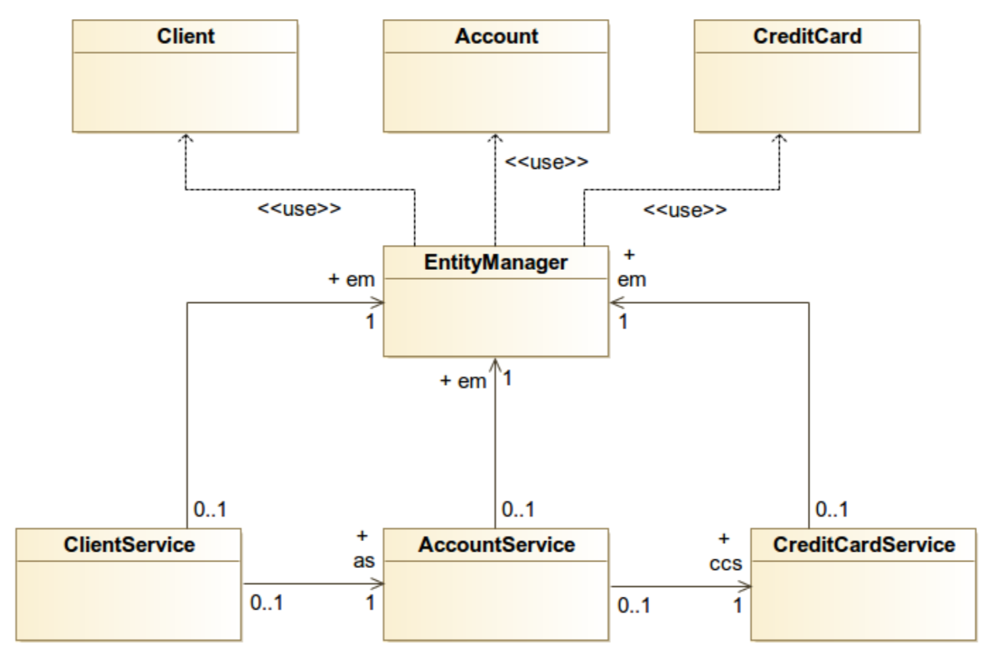

# CAES - Pràctica 1

## Objectiu

Partint d'un software ja existent, l'objectiu de la pràctica és que examineu el software, decidiu quins mètodes de 
quines classes s'ha de testejar, i dissenyeu i implementeu els tests. Aquest software **no el podeu modificar**, 
només podeu afegir tests.

## Material

Trobareu el codi d'aquest exercici al repositori. És un projecte Maven que pot ser obert directament amb qualsevol IDE.

## Lliurament

Aquesta pràctica es lliurarà com un repositori de [github ](http://www.github.com/) caldrà que el professor hi tingui accés per poder llegir-lo. Heu de seguir aquestes instruccions **AL PEU
DE LA LLETRA** per què la pràctica es pugui tractar automatitzadament:

1. Crear repositori al vostre compte personal de Github amb el codi proporcionat.
3. Crear els tests unitaris al package **org.udg.caes.banking**, carpeta *src/test/java* del repositori
4. El codi que hi ha a *src/main/java* **NO ES POT TOCAR NI UNA SOLA LÍNIA**. S'ha de mantindre exactament igual que l'original. Només podeu afegir codi als tests, a *src/test/java*
5. Els tests estaràn subdividits per test cases (classes de test) de manera que cada testcase només contindrà tests d'un sola classe. Per tant, us sortiran com a mínim tants testcases com classes poseu sota test. Per exemple, si decidiu que el mètode *transfer* de la classe *AccountService* s'ha de testejar, haureu de crear la classe *testAccountService* que contindrà només els tests d'aquella classe.
6. Les classes del package **FAKE** no s'han de testejar.Només s'ha nafegit per poder fer un *Main* que funcioni. 
7. Fer els commit amb les tasques assignades al vostre repositori (no cal fer Pull Request).
8. Cal assegurar que amb l'execució de *mvn test*:
   1. S'executen tots els testos que s'han creat 
   2. Es genera l'informe de cobertura de **JaCoCo**
   3. Acaba amb **BUILD SUCCESS**
9. Fer el lliurament al Moodle indicant la URL del repositori de GitHub, cal assegurar que el professor hi tingui accés.

## Sobre el software

El codi de la pràctica simula un sistema bancari on tenim 3 elements principals: clients, comptes corrents i targes 
de crèdit. El software està estructura en 2 capes:

1. Capa de servei (classes *AccountService*, *ClientService*, *CreditCardService*) on tenim la API del servei bancari.
2. Capa de persistència. Té 2 components:
    1. Servei de persistència (interfície *EntityManager*) per gestionar l'accés de les entitats cap a la BBDD
    2. Entitats (classes *Client*, *Account*, *CreditCard*)
    
Les relacions entre aquestes classes les podeu trobar al següent diagrama UML:

